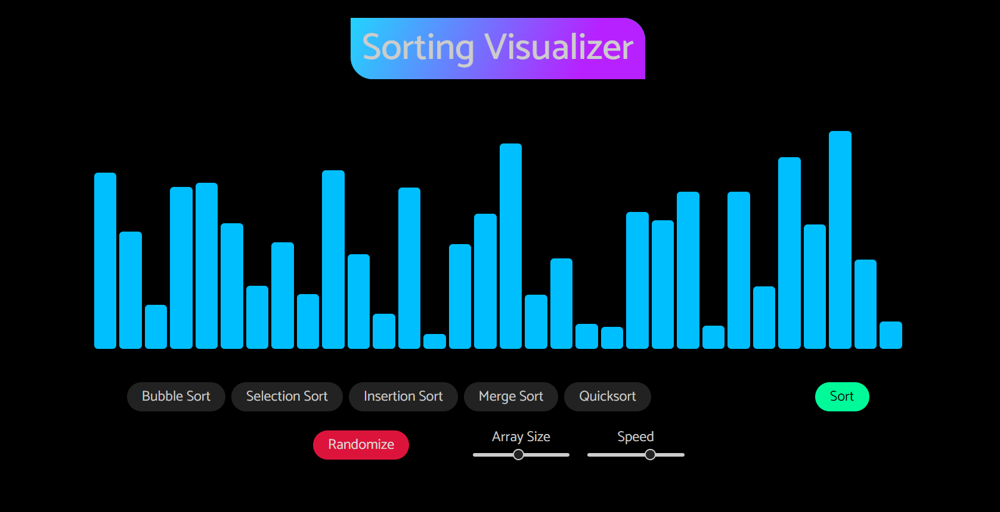

# Sorting Visualizer 📊

Welcome to the Sorting Visualizer! 🎉 This project visualizes various sorting algorithms, making it easier to understand how they work. You can see the algorithms in action right in your web browser.

Click the image above to view the project.

## Features ✨

- **Multiple sorting algorithms:** Visualize different sorting algorithms, including Bubble Sort, Selection Sort, Insertion Sort, Merge Sort, and Quick Sort. 🌀
- **Interactive UI:** Adjust the speed of the visualization and the size of the array to see how the algorithms perform under different conditions. ⚙️
- **Responsive design:** Enjoy the visualizations on various devices, including desktops, tablets, and smartphones. 📱

## Technologies Used 🛠️

- HTML5: For structuring the content of the application.
- CSS3: For styling and enhancing the visual appeal.
- JavaScript: For implementing the sorting algorithms and interactivity.

### Open the Application

1. Navigate to the project directory.
2. Open the `index.html` file in your preferred web browser. 🌐

### Choose a Sorting Algorithm

- Select the sorting algorithm you want to visualize . 🏷️

### Customize the Settings

- **Array Size:** Adjust the array size slider to change the number of elements to sort. 📏
- **Speed:** Adjust the speed slider to change the speed of the visualization. ⏩

### Start the Visualization

- Click the "Sort" button to see the sorting algorithm in action. 🎬
